# ARBME Triangular Arbitrage Opportunities

## Pool Triangle


## Current Pool States

### Pool 1: ARBME / WETH (Uniswap V4)
- **Pool ID**: `0x6afd39b7114a0892d10ffaae2eefcc16777dd376273c25d9d4f3a1a065131b83`
- **TVL**: $14,938
- **Fee**: 3%
- **Current Price**: $7.4516e-7 per ARBME
- **Deviation**: 0.00% from reference

### Pool 2: CLANKER / ARBME (Uniswap V4)
- **Pool ID**: `0x10830495714f0463b22fddb2e329e372f3ff86a865f01237cd98e4fc8770311a`
- **TVL**: $1,784
- **Fee**: 3%
- **Current Price**: $7.3322e-7 per ARBME
- **Deviation**: -1.60% from reference

### Pool 3: CLANKER / WETH (Uniswap V3)
- **Pool Address**: `0xc1a6fbedae68e1472dbb91fe29b51f7a0bd44f97`
- **TVL**: Unknown (need to query)
- **Fee**: 1%
- **Implied Rate**: 1 WETH = (3200 / 31.92) = ~100.25 CLANKER

## Arbitrage Paths


## Math: Triangular Arbitrage

### Path A: WETH → ARBME → CLANKER → WETH (Clockwise)

**Starting with 1 WETH ($3,200)**

```
Step 1: Buy ARBME with WETH (Pool 1)
  Input:  1 WETH = $3,200
  Fee:    3% = $96
  Net:    $3,104 buys ARBME
  Output: 3,104 / 7.45e-7 = 4,166,442,953 ARBME

Step 2: Sell ARBME for CLANKER (Pool 2)
  Input:  4,166,442,953 ARBME = $3,104
  Fee:    3% = $93.12
  Net:    $3,010.88 gets CLANKER
  Output: 3,010.88 / 31.92 = 94.32 CLANKER

Step 3: Sell CLANKER for WETH (Pool 3)
  Input:  94.32 CLANKER = $3,010.88
  Fee:    1% = $30.11
  Net:    $2,980.77 gets WETH
  Output: 2,980.77 / 3200 = 0.9315 WETH

Result: Started with 1 WETH, ended with 0.9315 WETH
LOSS: -0.0685 WETH = -$219.20 = -6.85%
```

**Total Fees Paid**: 3% + 3% + 1% = 7% round-trip

### Path B: WETH → CLANKER → ARBME → WETH (Counter-Clockwise)

**Starting with 1 WETH ($3,200)**

```
Step 1: Buy CLANKER with WETH (Pool 3)
  Input:  1 WETH = $3,200
  Fee:    1% = $32
  Net:    $3,168 buys CLANKER
  Output: 3,168 / 31.92 = 99.25 CLANKER

Step 2: Sell CLANKER for ARBME (Pool 2)
  Input:  99.25 CLANKER = $3,168
  Fee:    3% = $95.04
  Net:    $3,072.96 gets ARBME
  Output: 3,072.96 / 7.33e-7 = 4,192,733,698 ARBME

Step 3: Sell ARBME for WETH (Pool 1)
  Input:  4,192,733,698 ARBME = $3,123 (at 7.45e-7)
  Fee:    3% = $93.69
  Net:    $3,029.31 gets WETH
  Output: 3,029.31 / 3200 = 0.9467 WETH

Result: Started with 1 WETH, ended with 0.9467 WETH
LOSS: -0.0533 WETH = -$170.56 = -5.33%
```

**Total Fees Paid**: 1% + 3% + 3% = 7% round-trip

## Profitability Analysis


### Why Current Prices Don't Offer Profit

**Current Pool Prices:**
- Pool 1 (ARBME/WETH): $7.4516e-7
- Pool 2 (CLANKER/ARBME): $7.3322e-7 (implies ARBME 1.6% cheaper)
- Pool 3 (CLANKER/WETH): Implied rate unknown

**Analysis:**
1. Pool 2 prices ARBME 1.6% lower than Pool 1
2. But fees are 7% round-trip (3% + 3% + 1%)
3. Need spread > 7% to profit
4. Current spread = 1.6% << 7%
5. **Loss**: 5.4% on any triangular arb attempt

### Minimum Profitable Spread

```
For Path A (WETH → ARBME → CLANKER → WETH):
  Need Pool 2 ARBME price to be > 7% lower than Pool 1

For Path B (WETH → CLANKER → ARBME → WETH):
  Need Pool 2 ARBME price to be > 7% higher than Pool 1

Current spread: 1.6%
Required spread: 7%+
Gap: 5.4% more needed
```

## Two-Leg Arbitrage (Simpler Strategy)

Instead of triangular, focus on **two-pool arbitrage**:


**Math for Two-Leg:**
```
Start: X CLANKER
  ↓ Pool 2: Sell CLANKER → Buy ARBME (3% fee)
  ↓ Get: ARBME at $7.33e-7
  ↓ Pool 1: Sell ARBME → Get WETH (3% fee)
  ↓ Get: WETH at $7.45e-7 per ARBME
End: WETH worth more than starting CLANKER?

Total fees: 6%
Need spread: > 6% to profit
Current spread: 1.6%
Deficit: 4.4%
```

## Monitoring Targets

```mermaid
graph TD
    subgraph "Spread Thresholds"
        S0[Current Spread: 1.6%]
        S1[Break-Even: 6.5%]
        S2[Profitable: 7%+]
        S3[Good Opportunity: 10%+]
        S4[Excellent: 15%+]
    end

    S0 -.->|Need +4.9%| S1
    S1 --> S2
    S2 --> S3
    S3 --> S4

    ACTION1[✅ Bot Active at 6.5%+]
    ACTION2[⚡ Auto-execute at 7%+]
    ACTION3[🎯 Max position at 10%+]

    S1 --> ACTION1
    S2 --> ACTION2
    S3 --> ACTION3

    style S0 fill:#f56565
    style S1 fill:#ecc94b
    style S2 fill:#48bb78
    style S3 fill:#4299e1
    style S4 fill:#9f7aea
```



## Current State (Real-Time)

| Pool | Price (ARBME) | Deviation | TVL | Status |
|------|---------------|-----------|-----|--------|
| ARBME/WETH | $7.4516e-7 | 0.00% | $14,938 | ✅ Liquid |
| CLANKER/ARBME | $7.3322e-7 | -1.60% | $1,784 | ⚠️ Low liquidity |

**Spread Between Pools**: 1.60%
**Required for Profit**: 6.5%+
**Current Status**: ❌ No opportunity

## Action Items

1. **Monitor** pools every 5 seconds
2. **Alert** when spread ≥ 6.5%
3. **Model** trade profitability including:
   - Gas costs (~$0.01)
   - Swap fees (3% + 3% = 6%)
   - Slippage (1%)
4. **Execute** only if net profit > $0

## Expected Opportunity Frequency

Based on current 1.6% spread needing to widen to 6.5%:
- Need 4.9% price movement
- On low-liquidity pairs, this happens during:
  - Large buy/sell orders
  - Market volatility spikes
  - Liquidity provider withdrawals
  - Cross-DEX arbitrage by others

**Estimated**: 0-3 opportunities per week (data collection needed)

---

**Conclusion**: Current market is too efficient. The bot will wait for spreads to widen to profitable levels (6.5%+).
