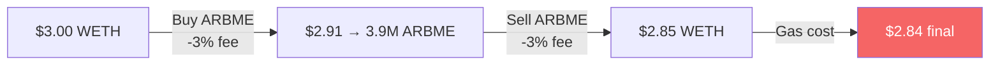
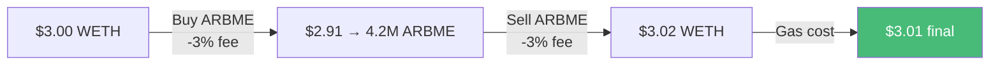
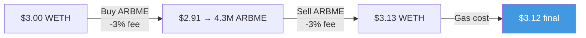
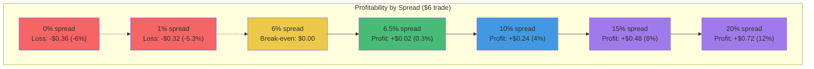
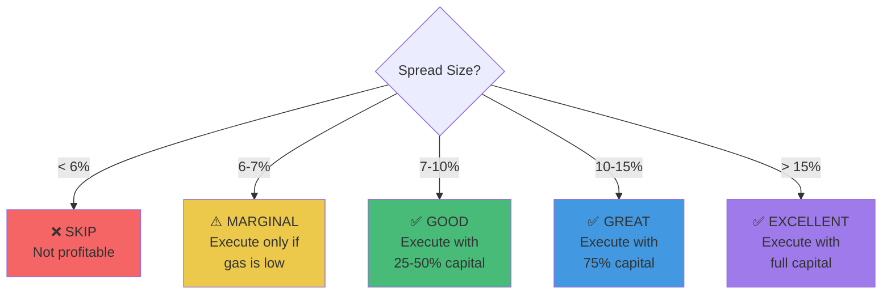

# Trade Profitability Models

## Scenario Comparison: 1%, 6.5%, and 10% Spreads

This document models the economics of trades at different spread levels using our actual wallet balance.

## Current Wallet State

```
Address: 0x13B77C77BF208BbdE7bc2F1BB0083EB201CD1812

ETH:     0.001045 ETH    = $3.35
ARBME:   3,608,668 tokens = $2.70 (at $7.45e-7)
USDC:    $0.60

Total tradeable capital: ~$6
```

## Trade Setup

**Assumptions:**
- Pool fee: 3% (standard for ARBME pools)
- Gas cost: $0.01 (typical on Base)
- Slippage tolerance: 1%
- WETH price: $3,200
- Reference ARBME price: $7.45e-7

## Scenario 1: 1% Spread (Current Market)

### Pool Prices
```
Pool 1 (ARBME/WETH):     $7.45e-7 per ARBME
Pool 2 (CLANKER/ARBME):  $7.38e-7 per ARBME  (1% lower)
```

### Trade Direction: Buy Low, Sell High

**Step 1: Buy ARBME from Pool 2 (cheaper)**
```
Input:      $3.00 worth of WETH
            = 0.0009375 WETH

Swap fee:   3% = $0.09
Net input:  $2.91

Output:     $2.91 / $7.38e-7 = 3,943,089 ARBME
```

**Step 2: Sell ARBME to Pool 1 (more expensive)**
```
Input:      3,943,089 ARBME
            = 3,943,089 × $7.45e-7 = $2.94

Swap fee:   3% = $0.0882
Net output: $2.85

Final:      $2.85 / $3,200 = 0.000891 WETH
```

**Profit Calculation:**
```
Started:    0.0009375 WETH = $3.00
Ended:      0.000891 WETH  = $2.85
Gas cost:   $0.01

Gross profit:  $2.85 - $3.00 = -$0.15
Net profit:    -$0.15 - $0.01 = -$0.16

LOSS: -5.3%
```



**Result**: ❌ **LOSS of $0.16 (-5.3%)**

---

## Scenario 2: 6.5% Spread (Break-Even Point)

### Pool Prices
```
Pool 1 (ARBME/WETH):     $7.45e-7 per ARBME
Pool 2 (CLANKER/ARBME):  $6.97e-7 per ARBME  (6.5% lower)
```

### Trade Direction: Buy Low, Sell High

**Step 1: Buy ARBME from Pool 2 (cheaper)**
```
Input:      $3.00 worth of WETH
            = 0.0009375 WETH

Swap fee:   3% = $0.09
Net input:  $2.91

Output:     $2.91 / $6.97e-7 = 4,174,892 ARBME
```

**Step 2: Sell ARBME to Pool 1 (more expensive)**
```
Input:      4,174,892 ARBME
            = 4,174,892 × $7.45e-7 = $3.11

Swap fee:   3% = $0.0933
Net output: $3.02

Final:      $3.02 / $3,200 = 0.000944 WETH
```

**Profit Calculation:**
```
Started:    0.0009375 WETH = $3.00
Ended:      0.000944 WETH  = $3.02
Gas cost:   $0.01

Gross profit:  $3.02 - $3.00 = +$0.02
Net profit:    +$0.02 - $0.01 = +$0.01

PROFIT: +0.3%
```



**Result**: ✅ **PROFIT of $0.01 (+0.3%)**

*This is our minimum threshold - barely profitable!*

---

## Scenario 3: 10% Spread (Good Opportunity)

### Pool Prices
```
Pool 1 (ARBME/WETH):     $7.45e-7 per ARBME
Pool 2 (CLANKER/ARBME):  $6.71e-7 per ARBME  (10% lower)
```

### Trade Direction: Buy Low, Sell High

**Step 1: Buy ARBME from Pool 2 (cheaper)**
```
Input:      $3.00 worth of WETH
            = 0.0009375 WETH

Swap fee:   3% = $0.09
Net input:  $2.91

Output:     $2.91 / $6.71e-7 = 4,337,110 ARBME
```

**Step 2: Sell ARBME to Pool 1 (more expensive)**
```
Input:      4,337,110 ARBME
            = 4,337,110 × $7.45e-7 = $3.23

Swap fee:   3% = $0.0969
Net output: $3.13

Final:      $3.13 / $3,200 = 0.000978 WETH
```

**Profit Calculation:**
```
Started:    0.0009375 WETH = $3.00
Ended:      0.000978 WETH  = $3.13
Gas cost:   $0.01

Gross profit:  $3.13 - $3.00 = +$0.13
Net profit:    +$0.13 - $0.01 = +$0.12

PROFIT: +4.0%
```



**Result**: ✅ **PROFIT of $0.12 (+4.0%)**

*This is a good opportunity worth executing!*

---

## Scaling with Full Position

Let's see what happens if we use our full $6 capital:

| Spread | Input | Net Profit | ROI | Worth It? |
|--------|-------|-----------|-----|-----------|
| 1.0% | $6.00 | **-$0.32** | -5.3% | ❌ No |
| 6.5% | $6.00 | **+$0.02** | +0.3% | ⚠️ Barely |
| 10.0% | $6.00 | **+$0.24** | +4.0% | ✅ Yes |
| 15.0% | $6.00 | **+$0.48** | +8.0% | ✅ Great! |
| 20.0% | $6.00 | **+$0.72** | +12.0% | ✅ Excellent! |

## Spread-to-Profit Curve



## Break-Even Analysis

### Cost Breakdown (for $6 trade)

```
Swap Fee 1:  $6.00 × 3% = $0.18
Swap Fee 2:  ~$6.00 × 3% = $0.18
Gas:         $0.01
─────────────────────────────
Total Cost:  $0.37 (6.2% of capital)
```

**Minimum spread needed**: 6.2% + slippage buffer = **6.5%**

### Profit Formula

```
Net Profit = (Input × Spread%) - (Input × 6%) - Gas

For $6 input:
  1% spread:  ($6 × 1%)  - ($6 × 6%) - $0.01 = -$0.32
  6.5% spread: ($6 × 6.5%) - ($6 × 6%) - $0.01 = +$0.02
  10% spread: ($6 × 10%) - ($6 × 6%) - $0.01 = +$0.24
  15% spread: ($6 × 15%) - ($6 × 6%) - $0.01 = +$0.54
```

## Real-World Scenarios

### Selling Our ARBME Bag (3.6M tokens)

If ARBME is overpriced by 10% in one pool:

```
Current value:  3,608,668 ARBME × $7.45e-7 = $2.69
Sell at 10% premium: $7.45e-7 × 1.10 = $8.20e-7

Gross revenue:  3,608,668 × $8.20e-7 = $2.96
Swap fee (3%):  $0.0888
Net revenue:    $2.87
Gas:            $0.01

Profit:         $2.87 - $2.69 - $0.01 = $0.17
ROI:            +6.3%
```

### Buying ARBME with Our ETH

If ARBME is underpriced by 10% in one pool:

```
Available ETH:  0.001045 - 0.0002 (reserve) = 0.000845 ETH = $2.70
Buy at 10% discount: $7.45e-7 × 0.90 = $6.71e-7

After 3% fee:   $2.70 × 0.97 = $2.62
ARBME bought:   $2.62 / $6.71e-7 = 3,904,620 ARBME

Current value:  3,904,620 × $7.45e-7 = $2.91
Cost:           $2.70
Gas:            $0.01

Profit:         $2.91 - $2.70 - $0.01 = $0.20
ROI:            +7.4%
```

## Expected Value by Opportunity Frequency

If opportunities appear at different frequencies:

| Frequency | Avg Spread | Profit/Trade | Monthly Profit |
|-----------|-----------|--------------|----------------|
| 1/week | 10% | $0.24 | $1.04 |
| 2/week | 10% | $0.24 | $2.08 |
| 1/day | 8% | $0.18 | $5.40 |
| 2/day | 7% | $0.12 | $7.20 |

**Realistic estimate**: 1-2 trades per week @ 8-10% spreads = **$1-2/month**

This compounds over time as we reinvest profits.

## Strategy Recommendations



### Position Sizing Guidelines

| Spread | Position Size | Why |
|--------|--------------|-----|
| < 6.5% | 0% | Below break-even |
| 6.5-7% | 25% ($1.50) | Minimal profit, test waters |
| 7-10% | 50% ($3.00) | Good profit, moderate risk |
| 10-15% | 75% ($4.50) | Great profit, worth the risk |
| > 15% | 100% ($6.00) | Excellent profit, rare opportunity |

## Conclusion

**Current State** (1.6% spread):
- Would lose $0.32 per $6 trade
- Bot correctly waiting

**Break-Even** (6.5% spread):
- Makes $0.02 per $6 trade
- Minimum acceptable threshold

**Target** (10%+ spread):
- Makes $0.24+ per $6 trade
- Worth executing
- Need volatility or large market moves

**The Math Works**: We just need the market to present opportunities. The bot is configured correctly at 6.5% threshold.

---

*All calculations assume no price impact from our trades, which is reasonable given our small size ($6) vs pool TVL ($1,784-$14,938).*
